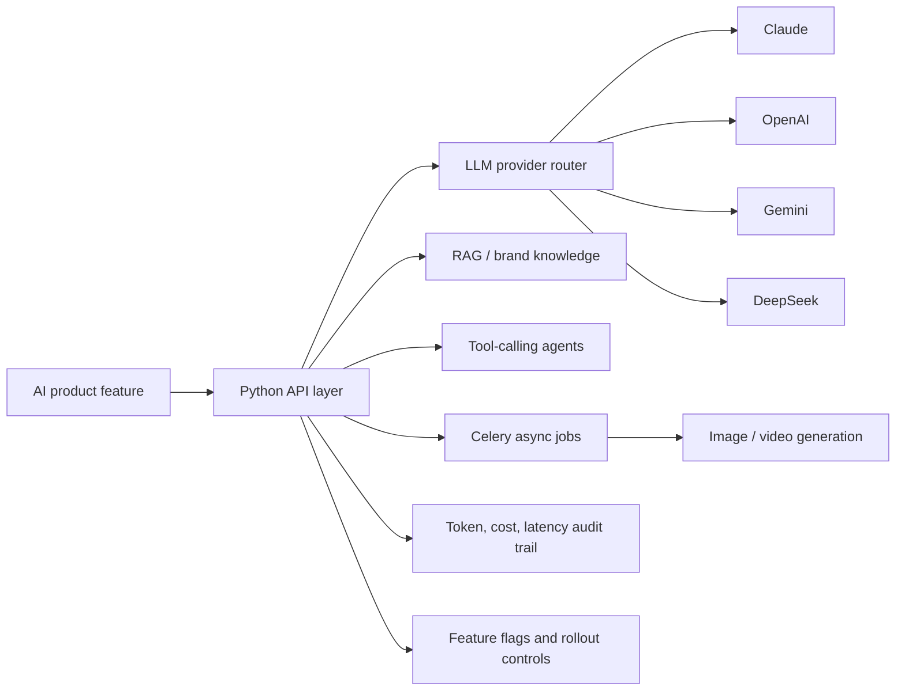

# Hi, I'm Awanish Mishra

**AI/LLM Application Engineer | Backend Engineer | Python, Django, FastAPI**

I build production LLM systems: multi-provider orchestration, RAG-backed knowledge workflows, agentic tooling, and the backend infrastructure needed to ship AI features reliably.

Currently, I work on the backend of **tingg.ai**, a multi-tenant AI content-generation SaaS. My focus is the less glamorous part of AI engineering: routing, retries, eval thinking, token/cost metering, idempotency, feature flags, and failure handling.

- Location: Noida, India
- Open to: AI Engineer, LLM Application Engineer, GenAI Engineer, AI Backend Engineer
- Contact: [awanishmishra245@gmail.com](mailto:awanishmishra245@gmail.com)
- LinkedIn: [linkedin.com/in/awanish-mishra](https://linkedin.com/in/awanish-mishra-08aa0322a/)

## What I Work On

## Production Experience

- Built and maintained backend systems for a multi-tenant AI SaaS with roughly **200 REST endpoints**, **99 models**, **6 Django apps**, and **270+ test files**.
- Engineered **multi-provider LLM orchestration** with fallback routing across Claude, OpenAI, Gemini, and DeepSeek.
- Implemented a **DAG-based AI workflow engine** for LLM, image, and video nodes with idempotent reruns, cancellation, and async execution.
- Built a **RAG-backed brand knowledge base** with ingestion, chunking, extraction, tagging, distillation, retrieval, and prompt-context injection.
- Developed **agentic features** including a tool-registry conversational agent and an autonomous template-authoring agent with validate/repair loops.
- Added **LLM observability and metering**: per-call token, cost, and latency audit trails, credit gating, and encrypted BYOK provider credentials.

## Current Public Portfolio Work

I am rebuilding the patterns from my private production work as public, non-proprietary projects:

| Project | Status | What it demonstrates |
|---|---:|---|
| `relay` | Designing | DAG-based LLM workflow engine with LangGraph, provider fallback, RAG nodes, evals, cost tracking, FastAPI/SSE, Docker, and MCP |
| `production-llm-systems-writeup` | Drafting | Architecture-level writeup of production LLM patterns: routing, RAG, agents, observability, rollout safety |
| `Glove-Compliance-Detection-System-` | Polishing | Computer vision pipeline, batch inference, JSON logging, annotated outputs, production-style README |
| `Fastapi-Smart-Banner` | Polishing | FastAPI service design and backend API practices |

## Technical Stack

**AI / LLM:** LLM orchestration, fallback routing, RAG pipelines, tool/function calling, structured outputs, prompt engineering, token/cost/latency auditing, AI image and video generation  
**Backend:** Python, Django, Django REST Framework, FastAPI, Flask, Celery, RabbitMQ, REST APIs, OpenAPI, JWT auth, RBAC, multi-tenant SaaS, webhooks  
**Cloud / DevOps:** AWS EC2, AWS S3, GCP, Docker, Jenkins CI/CD, Gunicorn, feature-flagged rollouts  
**Databases:** PostgreSQL, MySQL, SQLite  
**Testing / Automation:** pytest, Playwright, Selenium, RPA, n8n, web scraping  
**Frontend:** React, Next.js, JavaScript

## Writing Roadmap

I am publishing notes from real production work, stripped of proprietary details:

- Designing a multi-provider LLM fallback chain: what breaks in production
- RAG ingestion is five problems, not one: parse, chunk, extract, tag, distill
- Metering LLM cost per call: token audit trails and credit ledgers
- Building agents that validate and repair their own outputs

## Signals

- GATE Qualified - Data Science & AI, 2025
- Harvard CS50x - Computer Science
- B.Tech Computer Science & Engineering, 80%

## What I Am Looking For

I am looking for AI product teams where backend reliability matters as much as model capability: agent products, RAG systems, LLM platforms, AI SaaS, workflow automation, and Python-heavy backend teams building with LLMs.
