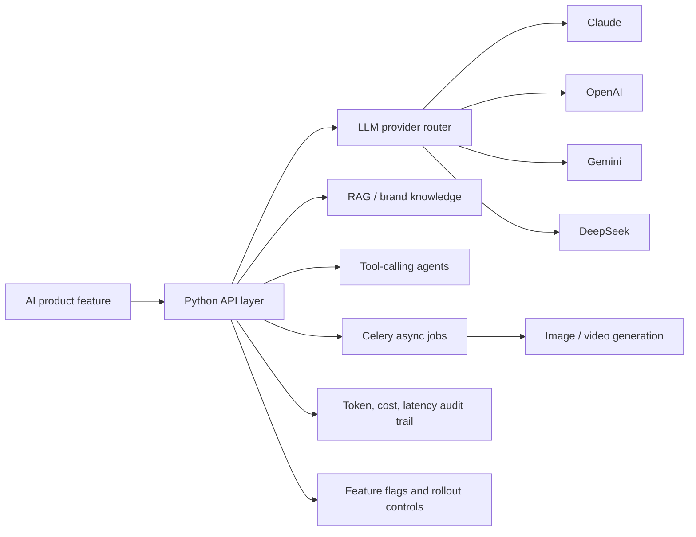

### Awanish Mishra

**AI / LLM Application Engineer · Backend Engineer**

---

I build **production LLM systems**: multi-provider orchestration, RAG-backed knowledge workflows,
agentic tooling, and the backend infrastructure needed to ship AI features reliably.

Currently on the backend of **tingg.ai**, a multi-tenant AI content-generation SaaS. My focus is the
less glamorous half of AI engineering — routing, retries, evals, token/cost metering, idempotency,
feature flags and failure handling.

> Most of my strongest work lives in private employer repositories. What is public here is the
> smaller half: side projects, and the patterns I am rebuilding in the open.

## Tech

## What I work on

```mermaid
flowchart LR
    Product[AI product feature] --> API[Python API layer]
    API --> Router[LLM provider router]
    Router --> Claude[Claude]
    Router --> OpenAI[OpenAI]
    Router --> Gemini[Gemini]
    Router --> DeepSeek[DeepSeek]
    API --> RAG[RAG / brand knowledge]
    API --> Agents[Tool-calling agents]
    API --> Jobs[Celery async jobs]
    Jobs --> Media[Image / video generation]
    API --> Metering[Token, cost, latency audit trail]
    API --> Flags[Feature flags and rollout controls]
```

## Production experience

**tingg.ai — multi-tenant AI content SaaS (backend)**

| What | Detail |
|---|---|
| Scale | ~200 REST endpoints, ~99 ORM models, 6 Django apps, a suite of 2,600+ tests |
| Orchestration | Multi-provider LLM routing with fallback across Claude, OpenAI, Gemini, DeepSeek |
| Workflows | DAG-based engine for LLM, image and video nodes — idempotent reruns, cancellation, async execution |
| Retrieval | RAG pipeline end to end: ingestion, chunking, extraction, tagging, distillation, weighted retrieval, context injection |
| Agents | Tool-registry conversational agent; autonomous template-authoring agent with validate/repair loops |
| Governance | Per-call token/cost/latency audit trails, append-only credit ledger, encrypted BYOK credentials |

**Freelance — [vatsaenterprises.in](https://vatsaenterprises.in)** · Node.js/Express/MongoDB + Angular

Payments (PhonePe), shipping integration, order and returns workflows, an auth-hardening pass that
closed a critical NoSQL-injection admin takeover, and a Lighthouse performance push
(catalogue 70 → 94, layout shift 0.75 → 0.02).

## Public projects

| Project | Stack | What it shows |
|---|---|---|
| [Glove Compliance Detection](https://github.com/Dizzy099/Glove-Compliance-Detection-System-) | Python, YOLOv8 | Computer-vision safety pipeline: batch inference, JSON logging, annotated outputs |
| [FastAPI Smart Banner](https://github.com/Dizzy099/Fastapi-Smart-Banner) | FastAPI | Clean API structure, request handling, deployment-ready patterns |
| [adFusion](https://github.com/Dizzy099/adFusion) | Python, JS | Ad recommendation prototype: personalisation and ranking logic |

## Writing

Notes from real production work, with proprietary details stripped out:

- Designing a multi-provider LLM fallback chain: what breaks in production
- RAG ingestion is five problems, not one — parse, chunk, extract, tag, distill
- Metering LLM cost per call: token audit trails and credit ledgers
- Agents that validate and repair their own output

## Background

`GATE Qualified — Data Science & AI (2025)` · `Harvard CS50x` · `B.Tech CSE, 80%`

## Open to

AI product teams where backend reliability matters as much as model capability — agent products,
RAG systems, LLM platforms, AI SaaS, workflow automation, and Python-heavy backend teams building
with LLMs.

