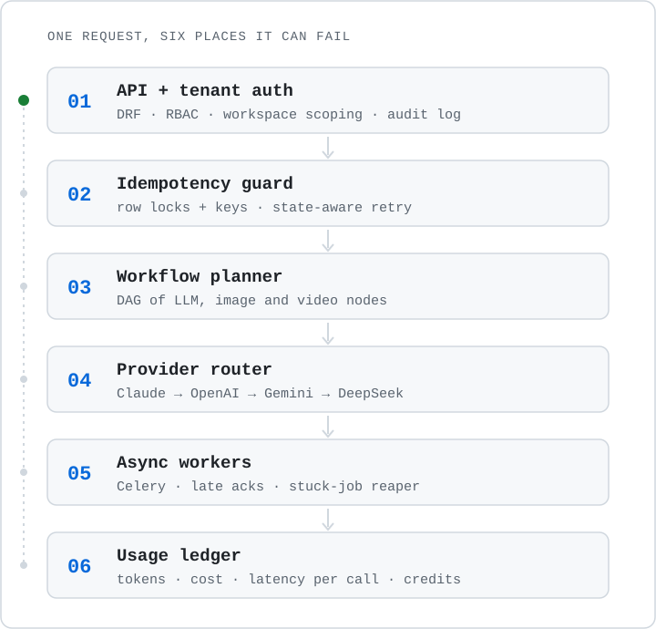

<picture>
  <source media="(prefers-color-scheme: dark)" srcset="assets/hero-dark.svg">
  <source media="(prefers-color-scheme: light)" srcset="assets/hero-light.svg">
  
</picture>

  <a href="#about"><code>GET /about</code></a> ·
  <a href="#work"><code>GET /work</code></a> ·
  <a href="#incident-log"><code>GET /incidents</code></a> ·
  <a href="#projects"><code>GET /projects</code></a> ·
  <a href="#stack"><code>GET /stack</code></a> ·
  <a href="#contact"><code>POST /contact</code></a>

## About

I'm **Awanish Mishra**, a backend engineer in Noida. I build the Python side of AI products:
the workflow engines, provider routing, async jobs and usage metering behind the "generate"
button.

Most of my work goes into what happens when things fail: a double-clicked button, a dead
worker, a model provider returning 503, a bill that has to add up. That's where I spend most
of my effort.

<table>
  <tr>
    <td valign="top" width="50%">
      <b>Now</b> 
      Associate Software Engineer at <b>The Higher Pitch</b>, on the backend of
      <b>tingg.ai</b>, a multi-tenant AI content SaaS.
    </td>
    <td valign="top" width="50%">
      <b>Also</b> 
      Freelance full-stack work on
      <a href="https://vatsaenterprises.in">vatsaenterprises.in</a>, a live e-commerce store:
      Node.js, Express, MongoDB and Angular.
    </td>
  </tr>
</table>

> [!NOTE]
> Nearly all of my production code lives in private employer repositories. This page describes
> that work as patterns and decisions. It contains no proprietary code, data, internal hostnames
> or client details.

## Work

<picture>
  <source media="(prefers-color-scheme: dark)" srcset="assets/pipeline-dark.svg">
  <source media="(prefers-color-scheme: light)" srcset="assets/pipeline-light.svg">
  
</picture>

<b>The Higher Pitch</b> · Associate Software Engineer · Oct 2025 – present (intern Apr – Sep 2025)

 

**tingg.ai**: businesses upload their brand documents, then generate on-brand posts, carousels,
images and videos through configurable AI workflows. I'm one of its backend engineers.

- **Workflow engine.** Templates are DAGs (directed acyclic graphs) of LLM, image, video and
  scraper nodes, run through a four-provider fallback chain (Claude → OpenAI → Gemini →
  DeepSeek). I worked on the planner and the chain, and closed paths that silently bypassed
  the fallback. A database-backed model registry means a new model is switched on from the
  admin panel, with no deploy.
- **Retrieval without a vector database.** Weighted full-text search supplies brand context.
  Embedding similarity against cached section descriptors routes each document chunk to the
  right knowledge-base page. The design principle is "store once, project many ways": chunks
  stay document-shaped, and a scored link table decides where they appear.
- **AI video pipeline.** Idea → script → storyboard → frames → clips, orchestrated on Celery
  (submit, poll, store to S3). It supports per-scene regeneration, version history,
  cancellation, and continuity between scenes (each scene starts from the last frame of the
  one before).
- **Agents with an eval gate.** A tool-calling agent drives the video pipeline through chat.
  A template-authoring agent writes a workflow, validates it, repairs it in a loop, and must
  pass a 12-case evaluation before the template is accepted.
- **Money that adds up.** Every model call is logged with its tokens, cost, latency and the
  exact run that spent it. Credits use an append-only ledger with two buckets (a monthly
  allowance that resets, and purchased credit that persists), plus a cost estimate before each
  run.
- **Tenancy and access.** A role hierarchy, workspace switching, admin impersonation with an
  audit trail, and soft delete with ownership transfer in place of cascading hard deletes.
- **Release safety.** Default-off feature flags, additive-only migrations, and a pytest guard
  that aborts if a test run is ever pointed at a shared database.

Codebase size, not traffic: about 200 REST endpoints, about 99 Django ORM models, and a
test suite past 2,600 tests.

**Across the team's other products**, I worked on creator-marketing, music and education backends:

- Instagram and Facebook automation driven by webhooks, with auto-replies, DMs, lead capture
  and link analytics. Duplicate replies are blocked by a database uniqueness constraint, not by
  application logic, because Meta forbids replying to the same comment twice.
- An API gateway fronting 40+ endpoints across six applications, with shared auth, error
  handling and retry.
- Access-control fixes found in review, including an IDOR (a missing ownership check) that let
  any logged-in user edit another user's records.

**Stack:** Python · Django · DRF · Celery · RabbitMQ · MySQL · Docker · Jenkins · AWS (EC2, S3)
· Claude · OpenAI · Gemini · DeepSeek

<b>Vatsa Enterprises</b> · Freelance Full-Stack Engineer · Sep 2026 – present

 

I build the API, storefront and admin panel for
[vatsaenterprises.in](https://vatsaenterprises.in), a live e-commerce site: 134 commits across
3 repositories.

- **Payments and shipping.** PhonePe checkout via webhooks and a payment state machine, plus
  Shiprocket tracking.
- **Pricing rules on the server.** Delivery charges, order limits, cash-on-delivery rules and
  discounts are now enforced server-side instead of trusted from the browser.
- **Security.** Closed a critical NoSQL-injection path to admin access and fixed Google
  sign-in flaws. Both are covered by an auth regression suite.
- **Speed.** Lighthouse performance on catalogue pages went from 70 to 94 (median of 3 runs).
  Layout shift fell from 0.75 to 0.024 by reserving grid space before products load. Also
  added AVIF/WebP image variants.
- **Order lifecycle.** Cancellations, returns, public order tracking and moderated reviews,
  covered by 21 backend test suites in CI.

**Stack:** Node.js · Express · MongoDB/Mongoose · Angular · TypeScript

<b>Vatsa Enterprises</b> · Software Developer Intern · Jan 2024 – Mar 2025

 

- Rebuilt a PHP/MySQL e-commerce platform, splitting catalogue, orders and reporting into
  separate services.
- Automated order processing, inventory updates and reporting with RPA scripts. By my own
  estimate (not an instrumented measurement), this roughly halved the manual work.

## Incident log

Real bugs from production systems I work on, each with its symptom, root cause and fix.
Internal names have been removed.

<b>"Generate all" made 14 images instead of 7</b> · double-submit race

 

|  |  |
|---|---|
| **Symptom** | A double click on "generate all images" produced two of everything and spent credits twice. |
| **Cause** | Two requests raced through the same check-then-create path. |
| **Fix** | `select_for_update()` row locks plus idempotency keys, rolled out across generation, credit purchases and workflow runs. |
| **Follow-up** | Retrying a *failed* clip then returned 409, because a stale lock was still held. I made the lock state-aware: it checks whether work is actually in flight before refusing. On a database error it fails open, which trades strictness for availability on purpose, and a test covers that behaviour. |

<b>Video generation worked on dev, returned 500 in another environment</b> · a job running synchronously inside the web server

 

|  |  |
|---|---|
| **Symptom** | Every video request returned 500, but only in one environment. |
| **Cause** | `CELERY_TASK_ALWAYS_EAGER` ran a 480-second provider poll inline, inside a Gunicorn worker with a 120-second timeout. |
| **Fix** | Turned eager mode off and made sure a live worker was consuming that queue. |
| **Rejected** | Raising the Gunicorn timeout. That would have hidden the problem while tying up web workers for eight minutes per request. |

<b>Uploaded documents stuck in "processing" forever</b> · two causes stacked

 

|  |  |
|---|---|
| **Cause 1** | Tasks were routed to a queue that no worker consumed. |
| **Cause 2** | Tasks were acknowledged when picked up, so a worker crash silently lost the job. |
| **Fix** | Queue names now come from one setting, so no task can be stranded by a hard-coded name. Also added `acks_late` with `reject_on_worker_lost`, a reaper that re-dispatches jobs stuck past 15 minutes, and an idempotent pipeline so retries are safe. |

<b>Usage costs drifted from provider pricing</b> · billing correctness

 

|  |  |
|---|---|
| **Cause** | Prompt-cache tokens were priced at zero, and image pricing for some providers had drifted. |
| **Fix** | Corrected the cache write and read rates. Built a dry-run-first reconciliation command to re-price past usage rows, plus a backfill that attributes each cost to its source. |
| **Judgment call** | Rows with no recoverable source stayed unattributed rather than being guessed. New rows are attributed when written, so that gap cannot grow. |

<b>"Only the last-updated automation rule fires"</b> · a regression test that can actually fail

 

|  |  |
|---|---|
| **Cause** | The resolver ordered candidate rules by `updated_at` descending. |
| **Fix** | Corrected the precedence and added five precedence tests. |
| **Proof** | Putting the old ordering back makes all five tests fail, and restoring the fix makes them pass. The tests are proven able to catch the bug, not just to pass. |

<b>I reviewed my own impersonation feature before release</b> · and found five auth flaws

 

1. Impersonating a superuser escalated a platform admin to full superuser.
2. "Stop impersonating" did not revoke the session token.
3. The impersonation token was not checked for expiry.
4. A platform admin could grant the role to themselves.
5. An act-as session had no time limit.

I reported all five with fixes before merge, and recommended shipping the feature's flags
default-off.

## Projects

Public work you can inspect. These are smaller than the production systems above, and they
say plainly what works and what doesn't.

<table>
<tr>
<td valign="top" width="50%">

**chunk-router** 
Python · ChromaDB · MiniLM embeddings

Routes document chunks to a fixed taxonomy by cosine similarity, and **measures** whether a
vector database is worth adding at all.

- Semantic routing: 69% top-1, against 31% for a lexical baseline (small synthetic corpus)
- Brute force still wins at 2,400 vectors; Chroma wins at 24,000
- A rebuild from scratch of a pattern I shipped at work, with synthetic data

Repository not yet public.
<!-- TODO: once pushed, replace the line above with:
[Repository →](https://github.com/Dizzy099/chunk-router) -->

</td>
<td valign="top" width="50%">

**[Smart Banner](https://github.com/Dizzy099/Fastapi-Smart-Banner)** 
FastAPI · Gemini 2.5 Flash · Pillow

Upload a product photo and a logo, get a marketing banner back.

- Gemini reads both images and plans the layout as JSON (positions and colour)
- Pillow renders the banner: text wrapping, overlay, scaled logo
- A second Gemini call critiques legibility. It is logged only for now and does not change
  the render

Prototype: session state is in-memory.

</td>
</tr>
<tr>
<td valign="top" width="50%">

**[Glove Compliance Detection](https://github.com/Dizzy099/Glove-Compliance-Detection-System-)** 
Python · YOLOv8 · OpenCV · multiprocessing

Checks images of workers for gloved or bare hands.

- YOLOv8 finds people; hand regions are estimated from each person's bounding box
- A weighted colour, texture and edge score classifies each hand
- Its own non-maximum suppression (merging overlapping detections), a batch CLI, JSON logs and
  annotated output

</td>
<td valign="top" width="50%">

**[adFusion](https://github.com/Dizzy099/adFusion)** 
Django · DRF · React · TinyLlama

Ad-copy generator that runs a local 1.1B-parameter model on CPU.

- Parses the model's output into headline, description, CTA (call to action) and hashtags
- Falls back to templates when the model's output can't be parsed
- JWT auth and a campaign data model

</td>
</tr>
</table>

Older and learning repositories

 

- [questValor](https://github.com/Dizzy099/questValor): Flask app with Google OAuth2 sign-in
  and a login-required decorator.
- [CS50-s-SQL](https://github.com/Dizzy099/CS50-s-SQL): problem sets from Harvard's
  databases course.
- The remaining repositories are coursework and early front-end experiments from 2022–2024.

## Stack

Listed only where I have shipped or built with it. Work and Projects say which is which.

  

| Area | What I use |
|---|---|
| **Backend** | Python, Django, DRF, FastAPI, Flask · Node.js, Express |
| **Data & async** | MySQL, PostgreSQL, MongoDB · Celery, RabbitMQ, cron · schema design, migrations, row locking, full-text search |
| **AI / LLM** | Claude, OpenAI, Gemini, DeepSeek · fallback routing, tool calling, structured outputs, embeddings, retrieval, eval gates, cost accounting |
| **Delivery** | Docker, Jenkins, AWS (EC2, S3), Gunicorn, Nginx · pytest, Ruff, Mypy, SonarQube, Trivy, Bandit |
| **Integrations** | Meta Graph API, Spotify, WordPress, Telegram, PhonePe, Shiprocket, webhooks |
| **Frontend** | React, Angular, TypeScript |

Education and credentials

 

- **B.Tech, Computer Science & Engineering**, Dr. Rammanohar Lohia Avadh University, 2021–2025
- **GATE qualified**, Data Science & AI (2025)
- **Harvard CS50x** (2023)
- **5th rank**, college hackathon (2023)

## Contact

I'm open to **backend and AI-backend roles**: teams where the LLM is one dependency among many,
and the job is making the system around it dependable. I'm based in Noida and open to
relocation.

  
  

The hero and diagram SVGs are generated by <code>build_assets.py</code> in this repo. No
third-party stats widgets, so nothing on this page breaks when a free service goes down.
