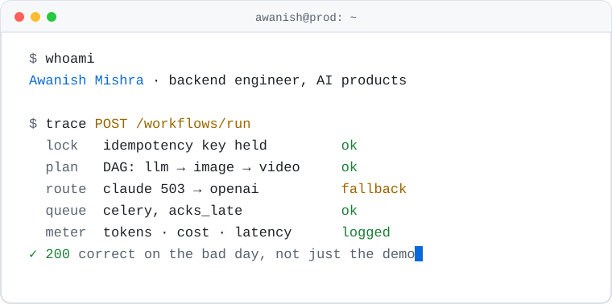
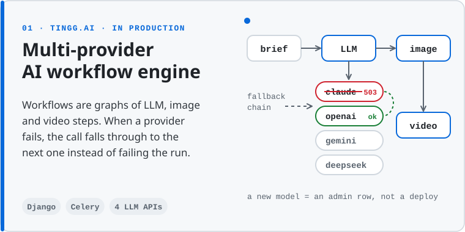
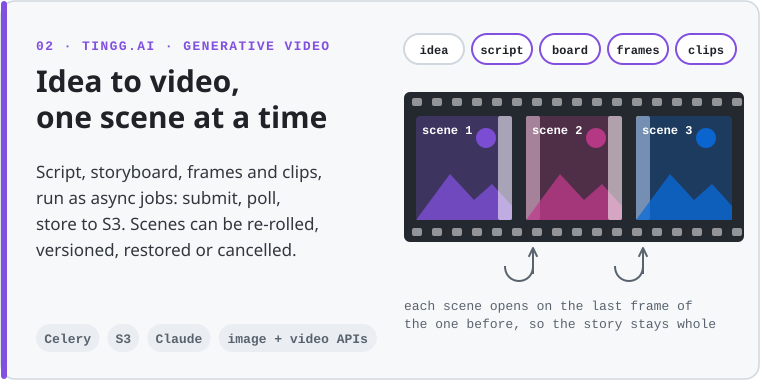
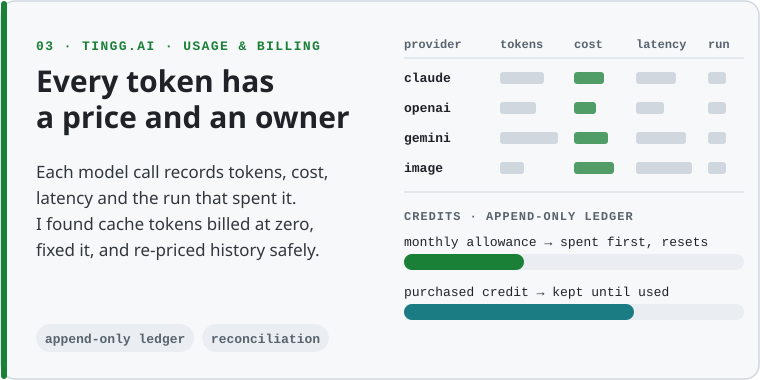
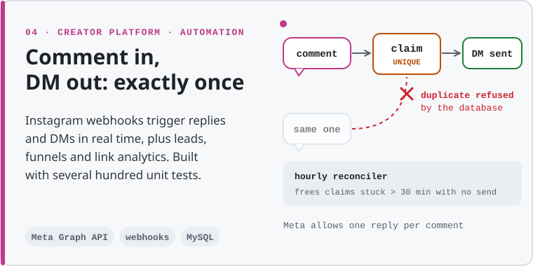
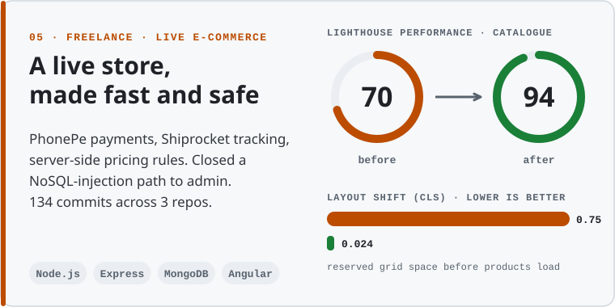
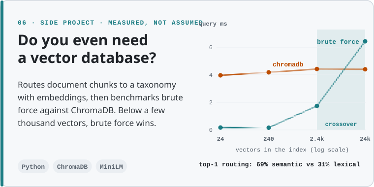

<picture>
  <source media="(prefers-color-scheme: dark)" srcset="assets/hero-dark.svg">
  <source media="(prefers-color-scheme: light)" srcset="assets/hero-light.svg">
  
</picture>

  <a href="#what-ive-built"><b>What I've built</b></a> ·
  <a href="#bug-hunts"><b>Bug hunts</b></a> ·
  <a href="#where-ive-worked"><b>Where I've worked</b></a> ·
  <a href="#public-code"><b>Public code</b></a> ·
  <a href="#contact"><b>Contact</b></a>

When someone clicks **Generate** in an AI product, I build what runs next: the workflow engine,
the model calls that fail over when a provider goes down, the background jobs, and the ledger
that makes sure the bill is right.

> [!NOTE]
> Most of this runs in private company code, so it's shown here as diagrams and decisions. No
> proprietary code, data or client details.

## What I've built

<picture>
  <source media="(prefers-color-scheme: dark)" srcset="assets/card-engine-dark.svg">
  <source media="(prefers-color-scheme: light)" srcset="assets/card-engine-light.svg">
  
</picture>

<picture>
  <source media="(prefers-color-scheme: dark)" srcset="assets/card-video-dark.svg">
  <source media="(prefers-color-scheme: light)" srcset="assets/card-video-light.svg">
  
</picture>

<picture>
  <source media="(prefers-color-scheme: dark)" srcset="assets/card-meter-dark.svg">
  <source media="(prefers-color-scheme: light)" srcset="assets/card-meter-light.svg">
  
</picture>

<picture>
  <source media="(prefers-color-scheme: dark)" srcset="assets/card-autodm-dark.svg">
  <source media="(prefers-color-scheme: light)" srcset="assets/card-autodm-light.svg">
  
</picture>

<picture>
  <source media="(prefers-color-scheme: dark)" srcset="assets/card-store-dark.svg">
  <source media="(prefers-color-scheme: light)" srcset="assets/card-store-light.svg">
  
</picture>

<picture>
  <source media="(prefers-color-scheme: dark)" srcset="assets/card-router-dark.svg">
  <source media="(prefers-color-scheme: light)" srcset="assets/card-router-light.svg">
  
</picture>

Card 06 is a from-scratch rebuild of a pattern I shipped at work, run on synthetic data. Its
repository isn't public yet.
<!-- TODO: once pushed, add: [chunk-router →](https://github.com/Dizzy099/chunk-router) -->

## Bug hunts

<picture>
  <source media="(prefers-color-scheme: dark)" srcset="assets/bugs-dark.svg">
  <source media="(prefers-color-scheme: light)" srcset="assets/bugs-light.svg">
  
</picture>

<b>Read the full story behind each bug</b>

 

**14 images instead of 7.** Two requests raced through the same check-then-create path.
`select_for_update()` row locks and idempotency keys fixed it across generation, credit
purchases and workflow runs. That caused a follow-up bug: retrying a *failed* clip then
returned 409, because a stale lock was still held. So the lock now checks whether work is
really in flight before refusing. It also fails open on a database error, on purpose, and a test
covers that.

**Every video request returned 500.** It happened in one environment only.
`CELERY_TASK_ALWAYS_EAGER` ran a 480-second provider poll inside a Gunicorn worker that times
out at 120 seconds. I turned eager mode off and made a live worker consume that queue. I
rejected raising the timeout, because that only hides the problem and ties up web workers
for 8 minutes each.

**Uploads stuck in "processing".** Two causes were stacked:
- Tasks were routed to a queue no worker listened to.
- Tasks were acknowledged on pickup, so a crashed worker lost the job.

The fix has four parts:
- Queue names now come from one setting.
- `acks_late` with `reject_on_worker_lost`.
- A reaper that re-dispatches anything stuck for more than 15 minutes.
- An idempotent pipeline, so retries are safe.

**Costs drifting from prices.** Prompt-cache tokens were priced at zero, and some image prices
had drifted. I corrected the rates and built a reconciliation command that does a dry run
first. Rows with no recoverable source were left unattributed rather than guessed.

**Only the newest rule fires.** The resolver sorted candidate rules by `updated_at`
descending. I added five precedence tests. Putting the old sort order back makes all five fail,
so the tests can actually catch the bug.

**Five auth flaws in my own feature.** Before merging admin impersonation, I reviewed it myself
and found five flaws:
- A privilege escalation to superuser.
- Sessions that "stop impersonating" did not revoke.
- No expiry check on the token.
- Admins could grant the role to themselves.
- No time limit on a session.

I reported all five with fixes, and recommended shipping the feature switched off by default.

## Where I've worked

| When | Where | What |
|---|---|---|
| **Oct 2025 – now** | **The Higher Pitch**, Noida Associate Software Engineer | Backend for **tingg.ai** (cards 01–03), plus creator, music and education products (card 04). About 200 REST endpoints and 99 Django ORM models. |
| Apr – Sep 2025 | The Higher Pitch Software Engineer Intern | Django services, including an API gateway fronting 40+ endpoints across six apps |
| **Sep 2026 – now** | **Vatsa Enterprises** Freelance, full-stack | [vatsaenterprises.in](https://vatsaenterprises.in) (card 05) |
| Jan 2024 – Mar 2025 | Vatsa Enterprises Software Developer Intern | PHP/MySQL store rebuild; RPA automation that roughly halved manual work (my own estimate) |

B.Tech CSE, Dr. Rammanohar Lohia Avadh University (2021–25) · GATE qualified, Data Science
& AI (2025) · Harvard CS50x · 5th rank, college hackathon

## Public code

Smaller than the systems above, and honest about what's finished.

| Repo | What it does |
|---|---|
| **[Smart Banner](https://github.com/Dizzy099/Fastapi-Smart-Banner)** FastAPI · Gemini · Pillow | Turns a product photo and a logo into a banner. Gemini plans the layout as JSON, Pillow renders it, and a second Gemini call critiques legibility (logged only, for now). |
| **[Glove Compliance](https://github.com/Dizzy099/Glove-Compliance-Detection-System-)** YOLOv8 · OpenCV | Checks images for gloved or bare hands. YOLOv8 finds people, then a colour, texture and edge score classifies each hand. Includes its own overlap filter (NMS) and a parallel batch CLI. |
| **[adFusion](https://github.com/Dizzy099/adFusion)** Django · React · TinyLlama | Ad-copy generator running a 1.1B-parameter model locally on CPU. Parses the model's output into structured fields, with a template fallback when parsing fails. |

## Stack

**Daily:** Python · Django/DRF · Celery · RabbitMQ · MySQL · Docker · Jenkins · AWS (EC2, S3) ·
Claude, OpenAI, Gemini and DeepSeek APIs · pytest · Ruff · Mypy 
**Also shipped with:** Node.js/Express · MongoDB · Angular · React · Meta Graph API · PhonePe · Shiprocket

## Contact

I'm looking for **backend and AI-backend roles**: teams where the model is one dependency and
the job is making everything around it dependable. I'm in Noida and open to relocation.

